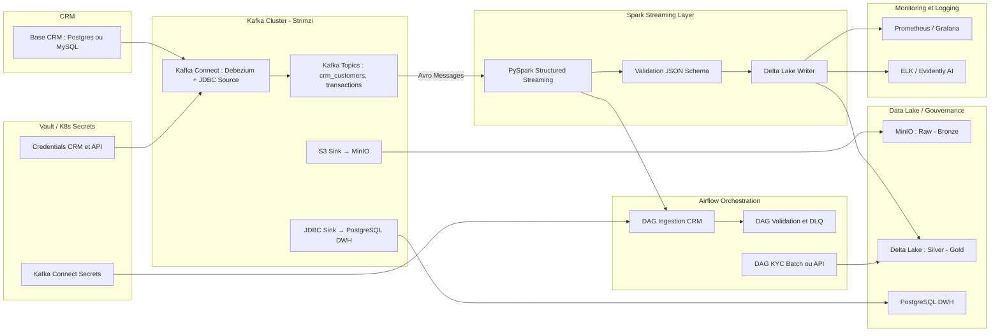

# 🏦 Plateforme de Scoring Automatisée — Ingestion & Intégration CRM

Ce module fait partie du projet **File Rouge — Plateforme de Scoring MLOps Complet**.  
Il gère la **collecte**, la **validation**, et la **centralisation** des données issues de plusieurs sources :
- CRM (clients, prospects)
- Transactions
- API externes (KYC, AML)
- Systèmes internes (RH, distribution)

---

## 🚀 Objectifs

- Centraliser les données multi-sources en temps réel (Kafka + Connect)
- Garantir la qualité et la traçabilité (schemas Avro / JSON)
- Gérer les erreurs et retries via DLQ
- Alimenter le Data Lake (MinIO / Delta Lake)
- Préparer les données pour le scoring et la détection de fraude

---

## 🏗️ Architecture Technique


## 📂 Structure des dossiers

```
ingestion/
├── kafka/
│   ├── connect/
│   │   ├── connectors/
│   │   │   ├── debezium-crm-source.json        # Connecteur Debezium pour CRM (Postgres/MySQL)
│   │   │   ├── jdbc-sink-dwh.json              # Sink JDBC vers Postgres ou Data Warehouse
│   │   │   ├── s3-sink-minio.json              # Sink vers MinIO/S3
│   │   │   ├── kyc-api-source.json             # (Optionnel) Connecteur REST API pour KYC
│   │   └── config/
│   │       ├── connect-distributed.properties  # Configuration principale du worker Connect
│   │       ├── secrets.env                     # Variables secrètes (vault ou k8s secrets)
│   │       └── log4j.properties
│   ├── topics/
│   │   ├── crm_customers.avsc                  # Schéma Avro pour les données CRM
│   │   ├── transactions.avsc                   # Schéma Avro pour les transactions
│   │   ├── kyc_response_schema.json            # Schéma JSON pour la validation KYC
│   │   └── topic_config.yaml                   # Config topics (partitions, retention, DLQ)
│   ├── scripts/
│   │   ├── create_topics.sh                    # Script d’automatisation création topics
│   │   ├── deploy_connectors.sh                # Script curl vers API Kafka Connect
│   │   └── test_ingestion.py                   # Test d’ingestion (latence, volumétrie)
│   └── manifests/
│       ├── kafka-cluster.yaml                  # CRD Strimzi Kafka (avec persistence + secrets)
│       ├── kafka-connect.yaml                  # Déploiement Connect (Strimzi)
│       ├── secret-kafka.yaml                   # Secret Kubernetes / Vault reference
│       ├── k8s-pvc.yaml                        # Volumes persistants
│       └── vault-policy.hcl                    # Policy HashiCorp Vault pour accès secrets
│
├── spark/
│   ├── notebooks/
│   │   ├── streaming_kafka_to_delta.ipynb      # Notebook PySpark (Kafka → Delta)
│   │   ├── validate_json_schema.ipynb          # Validation JSON schema des messages
│   │   ├── enrich_kyc_batch.ipynb              # Intégration API KYC et stockage
│   │   └── monitoring_drift.ipynb              # (Optionnel) Monitoring qualité data
│   ├── jobs/
│   │   ├── kafka_streaming_job.py              # Version exécutable du notebook
│   │   └── retry_dlq_handler.py                # Gestion retry/DLQ
│   ├── configs/
│   │   ├── spark_config.yaml                   # Paramètres SparkSession
│   │   └── delta_config.yaml                   # Paramètres Delta Lake
│   └── tests/
│       ├── test_streaming_ingestion.py         # Test de flux Kafka -> Delta
│       └── test_data_validation.py             # Validation JSON schema
│
├── airflow/
│   ├── dags/
│   │   ├── dag_ingestion_crm.py                # DAG orchestration ingestion CRM
│   │   ├── dag_ingestion_kyc.py                # DAG batch KYC
│   │   └── dag_monitoring_dlq.py               # DAG supervision des messages en erreur
│   └── plugins/
│       ├── operators/
│       │   ├── kafka_operator.py
│       │   ├── spark_submit_operator.py
│       │   └── vault_secret_operator.py
│       └── sensors/
│           └── kafka_topic_sensor.py
│
└── validation/
    ├── schemas/
    │   ├── crm_schema.json                     # Schéma de validation CRM
    │   ├── transaction_schema.json             # Schéma de validation transaction
    │   └── kyc_schema.json                     # Schéma de validation KYC
    ├── utils/
    │   ├── schema_validator.py                 # Utilitaire de validation JSON/Avro
    │   ├── dlq_handler.py                      # Gestion DLQ automatique
    │   └── retry_manager.py                    # Mécanisme de retry
    └── tests/
        ├── test_schema_validator.py
        └── test_dlq_retry.py

```
---
## ⚙️ Déploiement (mode dev / demo)
1️⃣ **Prérequis**

- Kubernetes 1.25+
- Helm 3+
- Strimzi Operator installé
- Vault / K8s Secrets activés
- MinIO, PostgreSQL déployés

2️⃣ **Déploiement avec Helm**

```bash
helm install kafka strimzi/strimzi-kafka-operator -f kafka/values.yaml
kubectl apply -f kafka/manifests/kafka-cluster.yaml
kubectl apply -f kafka/manifests/kafka-connect.yaml
```

3️⃣ **Déploiement des connecteurs**

```bash
cd ingestion/kafka/scripts/
bash deploy_connectors.sh
```
## ✅ Tests

- ``test_streaming_ingestion.py`` : vérifie la lecture Kafka → Delta
- ``test_data_validation.py`` : valide les schémas Avro/JSON
- ``test_dlq_retry.py`` : teste le mécanisme de retry/DLQ

## 🔒 Sécurité & Secrets

- Les credentials (DB, API, Kafka Connect) sont stockés dans :
  - **HashiCorp Vault** (``vault-policy.hcl``)
  - **Kubernetes Secrets** (``secret-kafka.yaml``)
- Les connecteurs référencent les secrets via ``valueFrom.secretKeyRef``.

## 📊 Monitoring

- **Prometheus + Grafana** → métriques Kafka / Spark / Airflow
- **Evidently AI** → drift de données et qualité des features
- **ELK Stack** → logs Kafka Connect et Airflow

